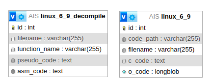
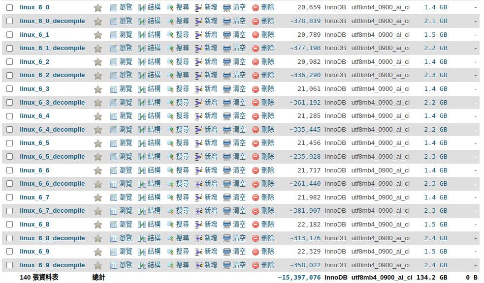

# Build Up the Database

## Install

### Docker

[Docker Tutorial](https://www.docker.com/)

### Run MySQL Container

```shell
docker run -d - name mysql-container -e MYSQL_ROOT_PASSWORD=<password> -p 3306:3306 mysql:latest
```

### Run phpMyAdmin Container

```shell
docker run --name myadmin -d -e PMA_ARBITRARY=1 -p 8080:80 phpmyadmin
```

## EX ER Diagram



## Peek



## Useful Tools

### Docker Management Tools

* [Portainer](https://www.portainer.io/)

### Proxy Management Tools

* [Nginx Proxy Manager](https://nginxproxymanager.com/)
